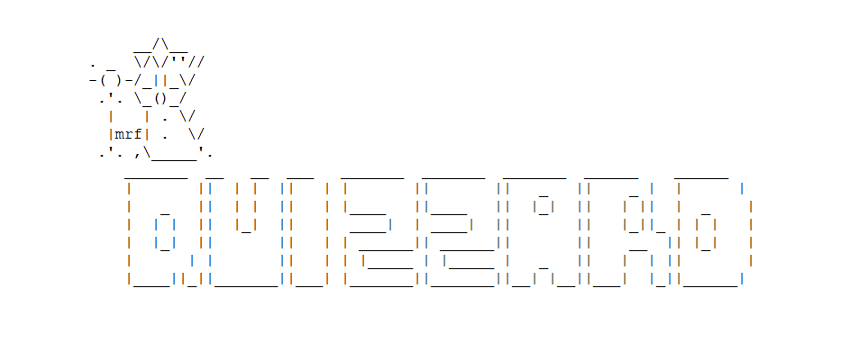
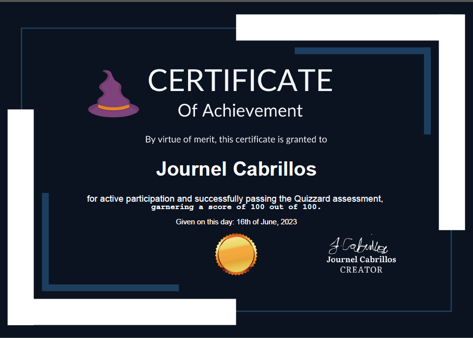
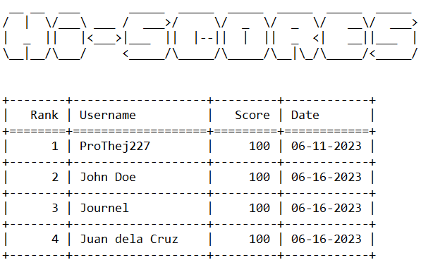

# Quizzard

#### Video Demo: <URL HERE>

#### Description:



Quizzard is a Python-based quiz game that assesses the user's general knowledge. Each user is tasked with answering 10 multiple-choice questions randomly selected from a predefined database of questions. The questions are composed of various categories, including Science and History (approximately 71%), as well as other categories such as Technology, Geography, Music, etc.

#### Functionality

##### How to play

1. Enter your name.
2. Click on *Start Quiz*.
3. Use the arrow keys to navigate through the answer choices.
4. Press *Enter* to submit your answer for each question.
5. After completing all 10 questions, you will be prompted to view your results and claim your certificate.

##### Certificates



A user with a score ≤ 80 will receive a certificate after confirming the prompt to view their score and certificate. Certificates are stored in the `"/certs"` directory. Certificates are generated using the fpdf2 library. A base template was generated using Canva, and the insertion of the dynamic texts (e.g., user name, date of completion, and score) is implemented using the aforementioned library. For reference, a sample certificate is shown above.

##### View High Scores



This feature displays the historical ranking of users based on their scores. Scores are data that are written in `scores.json` after every successful session or after a user finishes the game. When executed, the file `scores.json` is loaded as a Python dictionary, converted to a data frame, and then formatted as a table using the tabulate library.

##### Components

| Component              | Location       | Description                                                  |
| ---------------------- | -------------- | ------------------------------------------------------------ |
| Results                | quiz.py        | This class represents the results of a quiz or test. It takes the user data (username and answers) and the correct answers as input. It provides methods to calculate the score, check the correctness of answers, display the results in a tabular form, show a certificate dialog, and dump the scores to a JSON file. |
| QuestionDashboard      | quiz.py        | This class manages the display of questions to the user and generates user data. It takes the username and a list of questions as input. It provides a method to show each question, prompt the user for an answer, and generate a dictionary object of user data. |
| prompt                 | PyInquirer     | A function from the PyInquirer library that displays a prompt to the user and returns the selected choice. |
| Certificate            | certificate.py | This class represents a certificate. It inherits from the FPDF (Free PDF) class and is used to create a certificate with the given username and score. It sets up the certificate layout, including the background image and text positioning. It provides methods to set the name text, subtext lines, and transform the date. It generates the certificate as a PDF file. |
| QuizzardApp            | project.py     | This class represents the main user interface of the Quizzard application. It takes the user's name as input and provides methods to run the application, show the menu, start the quiz, show post-quiz results, and view high scores. It utilizes the Results and QuestionDashboard classes to manage the quiz and display the results. It also uses the prompt function from the PyInquirer library for user interaction. |
| run                    | project.py     | This method runs the QuizzardApp and starts the application by showing the menu. |
| show_menu              | project.py     | This method displays the menu to the user and prompts for a choice. Based on the choice, it calls the corresponding methods for starting the quiz, viewing high scores, or exiting the application. |
| start_quiz             | project.py     | This method initializes the quiz by loading the questions, shuffling the choices, and creating a QuestionDashboard object. It prompts the user with each question and generates user data. |
| show_post_quiz_results | project.py     | This method shows the post-quiz results to the user and offers the option to view the results, claim a certificate, and go back to the menu. It also calls the dump_scores method of the Results class to store the user's score. |
| view_high_scores       | project.py     | This method reads the scores from a JSON file, sorts them in descending order, and displays them in a tabular format using the tabulate library. If there are no scores, it notifies the user. |

##### Dependencies

The following is a list of dependencies required to run this project:

- fpdf == 1.7.2
- pandas == 1.2.5
- PyInquirer == 1.0.3
- tabulate == 0.9.0

##### File Structure

> 🌳 root_dir
> ├── 📁 assets
> │   └── 🖼️ background.png
> ├── 📁 certs
> ├── 📁 data
> │   ├── 📄 questions.json
> │   └── 📄 scores.json
> ├── 📄 certificate.py
> ├── 📄 project.py
> ├── 📄 quiz.py
> └── 📄 test_project.py

##### Installation

To run this project, you need to install the aforementioned dependencies. Open the terminal and type the following command:

```bash
python -m pip install -r requirements.txt
```

##### Run

To finally run it, simply type:

```bash
python project.py
```